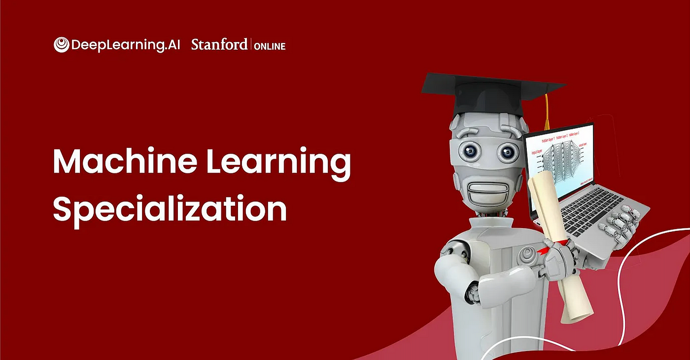

<a name="readme-top"></a>
<br />
<div align="center">
  <a href="#">
   <!-- Replace this logo for a custom official logo -->
    
  </a>

<h1 align = "center">
<b><i>Machine Learning Notebooks</i></b>
</h1>
    <!-- Add/Remove categories depending on your project -->
  <p align="center">
    Notebooks from the Machine Learning Specialization
    <br />
    <!-- IMPORTANT NOTE: If you want to append emojis you'll need to add the '-' sign before and after the header, as shown below:  -->
    <a href="#-modules-">Modules</a>
    ·
    <a href="#-license-">License</a>
  </p>
</div>

Break into AI with the free-to-audit [Machine Learning Specialization][MACHINE_LEARNING_SPECIALIZATION_URL].
Master fundamental AI concepts and develop practical machine learning skills in the beginner-friendly, 3-course program
by AI visionary Andrew Ng.

**What you'll learn:**
- **Build ML models with NumPy & scikit-learn**  
  - Build & train supervised models for prediction & binary classification tasks (linear, logistic regression)

- **Build & train a neural network with TensorFlow**  
  - Perform multi-class classification  
  - Build & use decision trees & tree ensemble methods  

- **Apply best practices for ML development**  
  - Use unsupervised learning techniques, including clustering & anomaly detection  

- **Build recommender systems**  
  - Use a collaborative filtering approach  
  - Implement a content-based deep learning method  
  - Build a deep reinforcement learning model  


## 🚀 Modules 🚀

### Course 1 - [Supervised Machine Learning: Regression and Classification][SUPERVISED_LEARNING_COURSE_URL]

In the first course of the Machine Learning Specialization, you will:

- Build machine learning models in Python using popular machine learning libraries NumPy and scikit-learn.
- Build and train supervised machine learning models for prediction and binary classification tasks, including linear
  regression and logistic regression

### Course 2 - [Advanced Learning Algorithms][ADVANCED_LEARNING_COURSE_URL]

In the second course of the Machine Learning Specialization, you will:

- Build and train a neural network with TensorFlow to perform multi-class classification
- Apply best practices for machine learning development so that your models generalize to data and tasks in the real
  world
- Build and use decision trees and tree ensemble methods, including random forests and boosted trees

### Course 3 - [Unsupervised Learning, Recommenders, Reinforcement Learning][UNSUPERVISED_LEARNING_COURSE_URL]

In the third course of the Machine Learning Specialization, you will:

- Use unsupervised learning techniques for unsupervised learning: including clustering and anomaly detection.
- Build recommender systems with a collaborative filtering approach and a content-based deep learning method.
- Build a deep reinforcement learning model.

<p align="right">(<a href="#readme-top">back to top</a>)</p>

## 📜 License 📜

```
This is free and unencumbered software released into the public domain.

Anyone is free to copy, modify, publish, use, compile, sell, or
distribute this software, either in source code form or as a compiled
binary, for any purpose, commercial or non-commercial, and by any
means.

In jurisdictions that recognize copyright laws, the author or authors
of this software dedicate any and all copyright interest in the
software to the public domain. We make this dedication for the benefit
of the public at large and to the detriment of our heirs and
successors. We intend this dedication to be an overt act of
relinquishment in perpetuity of all present and future rights to this
software under copyright law.

THE SOFTWARE IS PROVIDED "AS IS", WITHOUT WARRANTY OF ANY KIND,
EXPRESS OR IMPLIED, INCLUDING BUT NOT LIMITED TO THE WARRANTIES OF
MERCHANTABILITY, FITNESS FOR A PARTICULAR PURPOSE AND NONINFRINGEMENT.
IN NO EVENT SHALL THE AUTHORS BE LIABLE FOR ANY CLAIM, DAMAGES OR
OTHER LIABILITY, WHETHER IN AN ACTION OF CONTRACT, TORT OR OTHERWISE,
ARISING FROM, OUT OF OR IN CONNECTION WITH THE SOFTWARE OR THE USE OR
OTHER DEALINGS IN THE SOFTWARE.

For more information, please refer to <http://unlicense.org/>
```

[MACHINE_LEARNING_SPECIALIZATION_URL]: https://www.coursera.org/specializations/machine-learning-introduction#courses

[SUPERVISED_LEARNING_COURSE_URL]: https://www.coursera.org/learn/machine-learning?specialization=machine-learning-introduction

[ADVANCED_LEARNING_COURSE_URL]: https://www.coursera.org/learn/advanced-learning-algorithms?specialization=machine-learning-introduction

[UNSUPERVISED_LEARNING_COURSE_URL]: https://www.coursera.org/learn/unsupervised-learning-recommenders-reinforcement-learning?specialization=machine-learning-introduction